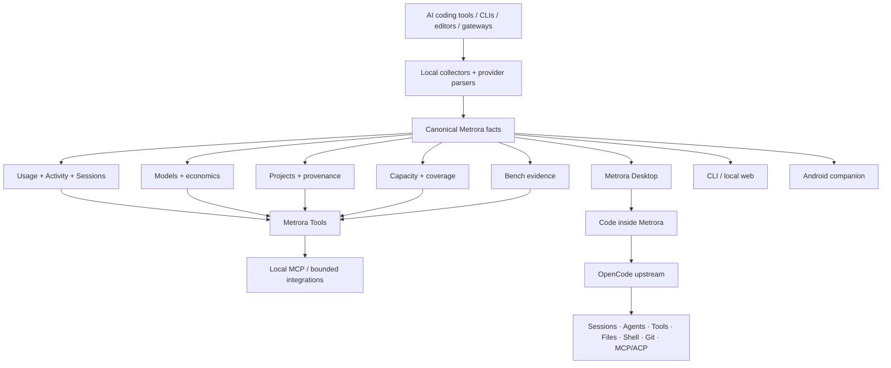

<div align="center">


### The local-first control center for AI-assisted development

**Observe usage. Compare models. Code with upstream OpenCode. Control the context around your AI workflow.**

No mandatory account. No mandatory AI proxy. No second coding engine.

[Get Metrora for Windows](https://apps.microsoft.com/detail/9NXSZFQSBBDX) · [Get Metrora on Google Play](https://play.google.com/store/apps/details?id=eu.metrora.app) · [Build from source](docs/GETTING_STARTED.md)

[Website](https://metrora.eu) · [Documentation](docs/README.md) · [Supported tools](docs/SUPPORTED_TOOLS.md) · [Community](https://metrora.eu/community)

[](https://github.com/maikolsiragusaa/metrora/actions/workflows/ci.yml)
[](https://apps.microsoft.com/detail/9NXSZFQSBBDX)
[](https://play.google.com/store/apps/details?id=eu.metrora.app)
[](https://github.com/anomalyco/opencode)
[](LICENSE)

</div>

> [!IMPORTANT]
> Metrora for Windows is live on the **Microsoft Store**, published by Vensent. The Android companion is also live on **Google Play** under the same `eu.metrora.app` application identity used by the direct Android channel. Repository builds and historical pre-releases remain development, verification or alternate-distribution artifacts rather than Store authority.

## Observe. Compare. Code. Control.

AI-assisted development is fragmented across editors, CLIs, desktop apps, subscriptions, gateways, providers and models. Metrora brings the useful evidence and control surfaces back together without requiring your AI requests to flow through a Metrora cloud gateway.

| Stage | What Metrora does |
| --- | --- |
| **Observe** | Unifies Usage, Cost, Activity, Sessions, Models, Projects and supported provider evidence from local sources. |
| **Compare** | Compares observed model/provider economics and methodology-bound Bench evidence without pretending every source is equally complete. |
| **Code** | Embeds the official upstream **OpenCode** runtime and Web UI inside Metrora Desktop instead of rebuilding a parallel coding-agent stack. |
| **Control** | Brings Capacity, budgets, Project scope, local settings and explicit Metrora-owned controls into the same control center. |

The result is intentionally broader than a token tracker: Metrora is the place where **facts, context, Code and control meet**.

## Why Metrora

- **Local-first.** Ordinary local use does not require a Metrora account or hosted backend.
- **No mandatory proxy.** Supported AI traffic can remain on the path chosen by the user; Metrora reads supported local evidence instead of demanding to become the gateway.
- **Multi-tool, not single-provider.** Metrora currently registers **39 local collectors** across major AI coding clients, CLIs, editors and gateways.
- **Evidence-aware.** Observed, metered, derived, estimated, stale, partial and unavailable states remain distinguishable. Unknown does not silently become zero.
- **Real Code surface.** Metrora embeds upstream OpenCode for coding sessions, agents, tools, files, shell and Git rather than shipping a lookalike client or second agent runtime.
- **One factual layer, many surfaces.** Desktop, CLI, local web, Android, MCP, Bench and Code integrations build on shared Metrora facts instead of inventing separate accounting engines.
- **User-owned data.** Export, local inspection and reproducible evidence remain first-class product boundaries.

## How the system fits together



Two responsibilities stay deliberately separate:

> **Metrora adds. OpenCode executes.**

Metrora owns its canonical facts, accounting, evidence, Projects, Capacity, Bench, host security and product context. OpenCode owns commodity coding-agent mechanics inside the Code surface.

## Code, powered by upstream OpenCode

The Desktop **Code** destination hosts the real upstream [OpenCode](https://github.com/anomalyco/opencode) Web UI and runtime.

Metrora deliberately does **not** maintain a parallel general-purpose session, agent, provider, permissions, filesystem, shell or Git engine for Code. The host integration keeps the upstream coding experience intact while Metrora adds the surrounding product context it is uniquely positioned to own.

Current Metrora host responsibilities include:

- deterministic pinned OpenCode runtime provenance;
- loopback-only embedded serving and per-launch authentication;
- persistent project/browser state and fast prewarmed entry;
- navigation and popup restrictions at the Electron boundary;
- clean process lifecycle and Windows packaging integration;
- OpenCode usage/accounting observation under the canonical `OpenCode` collector;
- bounded Metrora-specific factual context through the Metrora Tool boundary.

OpenCode is third-party upstream software and remains independently maintained. Metrora's integration does not imply affiliation with or endorsement by the OpenCode project.

See [OpenCode upstream surface](docs/OPENCODE_UPSTREAM_SURFACE_001.md) and [Ecosystem surfaces](docs/ECOSYSTEM_SURFACES.md).

## Facts before guesses

Metrora is built around a simple rule: **evidence strength is part of the answer**.

A value may be:

- **observed** directly from a source;
- **metered** by a provider or client;
- **derived** deterministically from stronger evidence;
- **estimated** under documented assumptions;
- **explicitly zero**;
- **partial, stale or unavailable**.

Those states are not interchangeable. Historical API-equivalent pricing is date-effective, settled cost assignments do not silently change when a catalog changes later, and subscription coverage stays separate from API-equivalent valuation.

This matters because an AI control center is only useful if its numbers remain explainable.

## Product surfaces

| Surface | Role | Current status |
| --- | --- | --- |
| **Desktop** | Primary local control center for observation, comparison, Code, Capacity and configuration | **Live on Microsoft Store for Windows** |
| **Code** | Upstream OpenCode runtime/Web UI hosted inside Metrora | **Available in the current Desktop line** |
| **CLI** | Automation, inspection, export and keyboard-first analysis | Bundled with Windows; source development supported |
| **Local web** | Browser view served from the local machine | Available locally |
| **Android** | Read-focused companion for an explicitly paired Desktop | **Live on Google Play**; direct GitHub APK channel also exists |
| **MCP** | Read-only external access to canonical factual Metrora Tools | Local MCP Server V1 available |
| **Bench** | Performance and compatibility evidence under explicit methodology | Performance + Core Compatibility foundations available |

Source trees also retain macOS and GNOME companion work, but a source surface is not presented as an official distribution until its own accepted public channel exists.

## Supported ecosystem

Metrora currently registers **39 local collectors**. The supported set includes sources such as Claude, Codex, Gemini, Cursor, GitHub Copilot, OpenCode, Antigravity, Zed, Kiro, Cline, Cline CLI, Roo Code, KiloCode, Qwen, Kimi, Warp and other compatible clients or gateways.

“Supported” is intentionally not a binary marketing claim. Metrora separately reports:

1. whether the source can be discovered and analyzed locally;
2. what evidence the source actually exposes;
3. what provenance/coverage limitations remain;
4. whether a concrete source path is approved for stronger signed-measurement workflows.

See [Supported tools](docs/SUPPORTED_TOOLS.md) and the generated [collector inventory](docs/COLLECTOR_INVENTORY_V1.md).

## Metrora Bench

Bench is not a generic leaderboard bolted onto usage analytics.

Its practical question is:

> **How does this declared model/runtime/configuration behave under this declared methodology and hardware?**

Current evidence families remain separate:

- **Performance** — including bounded native llama.cpp/`llama-bench` evidence;
- **Compatibility / Runtime Health** — deterministic Core Compatibility checks;
- **Coding Evaluation** — future, only under a versioned methodology and sandbox/licence boundary;
- **Agent Evaluation** — future, only under a versioned methodology and isolation boundary.

OpenCode already provides real Agent/Subagent execution inside Code; that does not by itself turn ordinary coding sessions into a reproducible Agent Evaluation benchmark.

See [Bench evidence families](docs/BENCH_EVIDENCE_FAMILIES.md).

## Android companion

Metrora for Android is available on [Google Play](https://play.google.com/store/apps/details?id=eu.metrora.app).

The companion pairs with an explicitly approved Metrora Desktop and consumes bounded Desktop-generated projections instead of becoming a second collector, pricing engine or accounting authority. Pairing uses encrypted transport and device trust; ordinary companion flows do not export prompt/response bodies, source files, patches, provider secrets or unrestricted filesystem paths.

The production-signed direct APK channel remains available for users who intentionally choose direct installation or Obtainium. See [Android public distribution](docs/ANDROID_PUBLIC_DISTRIBUTION_V1.md).

## Public direction

Metrora ships conservatively, but the direction is intentionally larger than tracking. The following are **directional areas, not delivery promises or a private execution plan**:

```text
stronger Sessions + Activity
        ↓
richer Models + economics + provenance
        ↓
deeper Projects + Capacity + Bench context
        ↓
more canonical Metrora Tools across Code / MCP / integrations
        ↓
bounded external control + remote/background supervision where safe
        ↓
smarter evidence-aware assistance, routing and automation
```

In parallel, Metrora is exploring richer privacy-aware sharing/recap surfaces built from canonical evidence rather than a second analytics pipeline.

The architectural constraint does not change as the product grows: Metrora should add differentiated facts, context, intelligence and control **without rebuilding commodity engines that a mature upstream already owns well**.

See [Ecosystem surfaces](docs/ECOSYSTEM_SURFACES.md) for current-versus-future status.

## Install Metrora

### Windows

Install from the [Microsoft Store](https://apps.microsoft.com/detail/9NXSZFQSBBDX). The Store package contains the Desktop application and bundled Metrora CLI runtime; no separate Node.js installation is required for ordinary use.

### Android

Install the companion from [Google Play](https://play.google.com/store/apps/details?id=eu.metrora.app). The direct GitHub Android release channel remains documented for users who intentionally choose direct APK installation.

### Build from source

For repository development and inspection, use Node.js 22.15 or newer:

```bash
git clone https://github.com/maikolsiragusaa/metrora.git
cd metrora
npm ci
npm run build:cli
npm run dev -- --help
```

Run the terminal dashboard:

```bash
npm run dev
```

Open the local browser dashboard:

```bash
npm run dev -- web
```

Build and validate Desktop:

```bash
npm --prefix app ci
npm --prefix app test
npm --prefix app run typecheck
npm --prefix app run build
```

Repository builds are development/inspection artifacts, not Store-signed releases. See [Getting started](docs/GETTING_STARTED.md).

## CLI highlights

| Command | Purpose |
| --- | --- |
| `metrora overview` | Usage/cost overview for a period or date range |
| `metrora sessions` | Per-session evidence |
| `metrora models` | Per-model usage, token and cost evidence |
| `metrora compare` | Side-by-side model comparison |
| `metrora status` | Compact status output |
| `metrora doctor` | Provider discovery and parser diagnostics |
| `metrora audit` | Compare available source evidence with displayed totals |
| `metrora export` | Export user-owned data as CSV or JSON |
| `metrora bench ...` | Run bounded Bench workflows under explicit methodology |
| `metrora mcp serve` | Start the local read-only Metrora MCP server |

The complete command surface and compatibility boundaries live in the [CLI reference](docs/CLI_REFERENCE.md).

## Privacy and security

Metrora is local-first by default:

- no account is required for ordinary local use;
- AI traffic does not need to pass through Metrora;
- prompts, responses, source code, patches, secrets and unrestricted local paths are outside the default sharing boundary;
- Android consumes bounded projections from an explicitly paired Desktop;
- optional Workspace/device connections require explicit scope and revocable authorization;
- user-owned evidence remains exportable through documented formats.

Read [Product principles](docs/PRODUCT_PRINCIPLES.md), [Public contracts](docs/PUBLIC_CONTRACTS_V1.md), [Workspace v1](docs/WORKSPACE_V1.md) and [Security](SECURITY.md).

## Documentation

Start with the [documentation home](docs/README.md).

Recommended paths:

- [Getting started](docs/GETTING_STARTED.md)
- [Architecture](docs/architecture.md)
- [Ecosystem surfaces](docs/ECOSYSTEM_SURFACES.md)
- [OpenCode upstream surface](docs/OPENCODE_UPSTREAM_SURFACE_001.md)
- [Supported tools](docs/SUPPORTED_TOOLS.md)
- [CLI reference](docs/CLI_REFERENCE.md)
- [Accounting and pricing](docs/ACCOUNTING_AND_PRICING.md)
- [Bench evidence families](docs/BENCH_EVIDENCE_FAMILIES.md)
- [Android companion](docs/ANDROID_COMPANION_FOUNDATION.md)
- [Local companion API](docs/LOCAL_COMPANION_API.md)

Deep compatibility, release and public-contract documents remain linked from the documentation home rather than competing with the product overview here.

## Repository map

```text
src/       canonical collection, parsing, pricing, analytics, evidence, Tools and CLI
app/       Electron Desktop host and Metrora product UI
dash/      local browser dashboard
android/   Google Play / direct-channel Android companion source
mac/       macOS companion source
gnome/     GNOME Shell companion source
tests/     core and integration tests
docs/      user guides, architecture, public contracts and release evidence
scripts/   bounded build, verification and migration utilities
```

## Contributing

Read [CONTRIBUTING.md](CONTRIBUTING.md) before opening a pull request. Provider/parser changes require fixtures, focused tests, provenance/privacy review and representative-record validation where possible.

Security issues must be reported privately according to [SECURITY.md](SECURITY.md).

## Community

The public Metrora community is available through [metrora.eu/community](https://metrora.eu/community). Technical issues and pull requests stay on GitHub; security reports stay private.

## Origin, third-party software and licence

Metrora is independently maintained under its own product identity and distributed under the MIT License. Third-party software — including the upstream OpenCode component used by Code — retains its own project identity, licence and notices.

Required notices and licence texts remain in [THIRD_PARTY_NOTICES.md](THIRD_PARTY_NOTICES.md) and [`LICENSES/`](LICENSES/).

Metrora™ is the product and user-facing brand. Signal Grid™ is its canonical visual identity. Vensent™ is the publisher identity used for official Metrora distribution.

See [NOTICE.md](NOTICE.md), [BRAND_POLICY.md](BRAND_POLICY.md) and [LICENSE](LICENSE).

Metrora™ — published by Vensent™. Copyright © 2026 Metrora contributors.
