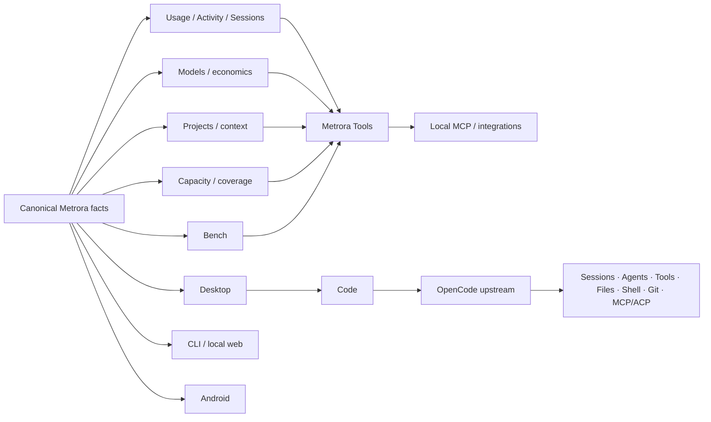

# Metrora ecosystem surfaces

**Status:** public product direction and implementation-status guide  
**Decision revision:** 2026-09-05

Metrora is a local-first control and intelligence system for AI-assisted development. Its surfaces compose around shared facts and explicit authority boundaries instead of becoming parallel engines that each invent their own truth or execution mechanics.

This page is deliberately public-facing: it explains what exists, how the pieces fit together and which directions are being explored. It does **not** publish private implementation sequencing, commercial packaging or internal infrastructure.

## The ecosystem in one diagram



Canonical rule for Code:

> **Metrora adds. OpenCode executes.**

Metrora owns canonical evidence/accounting, Projects, Capacity, Bench, its Tool contracts, the host/security boundary and product context. OpenCode owns the commodity coding surface and its normal session/agent/tool mechanics.

## Current status

| Surface | Product job | Current status |
| --- | --- | --- |
| **Usage / Activity / Sessions / Models** | Local factual evidence, history, attribution and economics | **Available**, with ongoing data-quality and product-depth work |
| **Projects** | User-controlled Metrora context and scope across relevant evidence | **Available** |
| **Capacity** | Provider-reported quota/capacity where trustworthy evidence exists | **Available** with explicit unavailable/stale semantics |
| **Tools** | Typed factual access to canonical Metrora evidence | **Available** — shared registry, contracts, evidence and privacy layer |
| **Code** | Coding/agent work through upstream OpenCode hosted by Desktop | **Available** — accepted OpenCode `1.18.27` runtime/Web UI with Metrora host lifecycle, prewarm, security, persistence, packaging and accounting integration |
| **Bench** | Performance-first testing plus separate Compatibility / Runtime Health evidence | **Available foundations** — native llama.cpp/`llama-bench` Performance and Core Compatibility remain separate bounded paths |
| **MCP** | External factual access to canonical Metrora Tools | **Available** — local read-only MCP Server V1 |
| **Android** | Read-focused companion to an explicitly paired Desktop | **Live on Google Play**; direct APK channel also documented |
| **ACT / ActionContract** | Trusted lifecycle for explicitly Metrora-owned bounded actions | **Available for a narrow Core Compatibility operation**; not a universal wrapper around Code |
| **Widgets / recap surfaces** | Privacy-aware presentation/share experiences built from canonical evidence | **Foundation exists; broader direction planned** |
| **Remote/background/external control** | Bounded supervision and delegation above local sessions | **Future / separately gated** |

Status labels are intentionally conservative. A public direction is not described as shipped until working product authority exists.

## Code: upstream engine, Metrora control center

The Desktop **Code** destination hosts the real upstream [OpenCode](https://github.com/anomalyco/opencode) Web UI/runtime rather than a Metrora reconstruction.

The accepted host boundary includes:

- pinned OpenCode `1.18.27` provenance;
- deterministic staged binary checks;
- loopback-only embedded serving;
- random per-launch authentication held by Electron main;
- exact-origin navigation restrictions and popup denial;
- persistent upstream browser/project state;
- prewarmed hidden loading for fast Code entry;
- clean sidecar shutdown;
- Windows package paths that include the pinned runtime;
- Metrora accounting under the canonical **OpenCode** collector.

OpenCode remains upstream authority for its coding Sessions, Agents/Subagents and standard coding mechanics. Metrora does not create a second conversation/session universe for the same work.

OpenCode is third-party upstream software and remains independently maintained. The integration does not imply affiliation or endorsement.

## Metrora Tools inside Code

The point of Metrora Tools is to let an accepted runtime ask Metrora-specific factual questions **without moving accounting or evidence logic into the runtime adapter**.

The first physically accepted proof is the bounded `metrora_usage_snapshot` integration:

```text
question inside Code
      ↓
OpenCode chooses a Metrora-specific tool
      ↓
Metrora returns bounded factual evidence
      ↓
OpenCode explains the result
```

The broader direction is to expose high-value canonical Metrora capabilities through the shared Tool contracts — not to create dozens of duplicate Code-only mini APIs.

Examples of canonical factual families already represented in the Metrora Tool layer include:

- spend/Usage evidence;
- model/economics evidence;
- overview/context evidence;
- Project drivers;
- Session highlights;
- coverage/freshness;
- Bench evidence;
- provider Capacity where the consuming authority can supply it truthfully.

A model may explain a Tool result. It may not silently replace Metrora's canonical measurement, scope or unavailable-state semantics.

## MCP: interoperability without becoming the proxy

The shipped Metrora MCP Server V1 is **local and read-only**. It exposes canonical factual Tools to compatible external clients without requiring ordinary AI requests to pass through Metrora.

Principles:

- local-first and account-optional;
- factual/read-only first;
- shared Tool/evidence authority rather than MCP-specific accounting;
- no arbitrary shell, filesystem, repository or secret access;
- no bypass around Metrora privacy/scope contracts;
- MCP failure cannot corrupt canonical Metrora history.

OpenCode consuming MCP servers is a different direction from an external client controlling Metrora. The two should not be confused.

## Future external control

Metrora's public direction includes the possibility of **bounded external control and remote/background supervision**.

The public concept is intentionally simple:

```text
ChatGPT / Claude / compatible external client
                    ↓
        bounded Metrora control boundary
                    ↓
       Metrora context + evidence + policy
                    ↓
      accepted execution runtime when needed
                    ↓
          status / result / evidence
```

This is future work, not a claim that today's read-only MCP server can execute arbitrary tasks.

The architecture should preserve explicit authorization and avoid browser/UI automation as the product control plane.

## Bench

Metrora Bench remains a methodology-bound evidence system rather than a generic “AI score”.

Primary public direction:

- **Performance** — how a declared model/runtime/configuration actually behaves on declared hardware.

Separate evidence families:

- **Compatibility / Runtime Health** — including deterministic Core Compatibility;
- **Coding Evaluation** — future, versioned and methodology/licence/sandbox gated;
- **Agent Evaluation** — future, versioned and methodology/isolation gated.

Real OpenCode Agent/Subagent execution already exists. That does not by itself define a reproducible Agent Evaluation methodology.

## ACT / ActionContract

ACT is intentionally narrow.

The current public ActionContract foundation binds a documented Metrora-owned Core Compatibility workflow to explicit confirmation/lifecycle/evidence semantics.

It is **not** a requirement that ordinary OpenCode edits, shell commands or Git actions pass through a second Metrora permissions engine. Those mechanics belong to the upstream Code surface.

Future stronger Metrora-owned effects, if shipped, require their own explicit trust/control boundary.

## Android

Metrora for Android is live on [Google Play](https://play.google.com/store/apps/details?id=eu.metrora.app).

The companion consumes bounded projections from an explicitly paired Desktop. It does not independently become the collector, pricing authority or canonical history engine.

The direct production-signed APK channel remains useful for intentional direct installation/Obtainium and has its own source/signing/integrity contract.

## Widgets, sharing and recap direction

Metrora already has a local Share Card foundation. A broader direction is to build reusable, privacy-aware presentation primitives from canonical evidence, for example:

- Usage/cost cards;
- model/provider mix;
- Project or Activity summaries;
- Bench Performance results;
- methodology-labelled comparisons;
- periodic recap experiences.

The important boundary is that presentation does not become a second analytics engine. A share/recap surface should be derived from canonical Metrora evidence.

## Naming

Ordinary product navigation stays concise:

`Usage · Activity · Models · Capacity · Projects · Code · Bench · Settings`

Systems with an independent protocol/methodology identity can use fuller names on first mention:

- **Metrora Bench**;
- **Metrora MCP Server**.

`ACT` remains a bounded action authority, not a primary product mode. There is no current separate `Swarm` product surface.

## Public direction

The next public direction is deliberately expressed as capability growth rather than a private milestone schedule:

```text
CURRENT CONTROL CENTER
Usage · Activity · Models · Projects · Capacity · Bench · Code
                         │
                         ▼
       stronger Sessions / Models / factual quality
                         │
                         ▼
      richer Projects / Capacity / Bench context
                         │
                         ▼
      more canonical Tools across Code + integrations
                         │
                         ▼
       bounded remote/background/external control
                         │
                         ▼
       evidence-aware assistance and automation
```

Parallel work can improve collectors, pricing/provenance, Bench reliability, Android supervision and distribution quality without waiting for later control capabilities.

What is intentionally **not** published here:

- internal implementation sequencing;
- private infrastructure topology;
- credentials or operational access patterns;
- unpublished commercial packaging/pricing;
- private routing/decision policy details.

The public promise is architectural rather than tactical: Metrora should become a stronger control center by improving its own facts, context, intelligence and control — **not by rebuilding mature commodity engines merely to own more code**.

## Visual direction

Current Markdown diagrams are intentionally source-versionable. Product screenshots and original Metrora diagrams can be added later without changing the authority described here.

Historical/inherited marketing imagery should not be presented as new Metrora artwork. Third-party logos and marks remain subject to their own trademark/licence rules.

See also:

- [`architecture.md`](architecture.md)
- [`OPENCODE_UPSTREAM_SURFACE_001.md`](OPENCODE_UPSTREAM_SURFACE_001.md)
- [`BENCH_EVIDENCE_FAMILIES.md`](BENCH_EVIDENCE_FAMILIES.md)
- [`ACT_CONTRACT_PREP_001.md`](ACT_CONTRACT_PREP_001.md)
- [`PRODUCT_PRINCIPLES.md`](PRODUCT_PRINCIPLES.md)
- [`PUBLIC_CONTRACTS_V1.md`](PUBLIC_CONTRACTS_V1.md)
