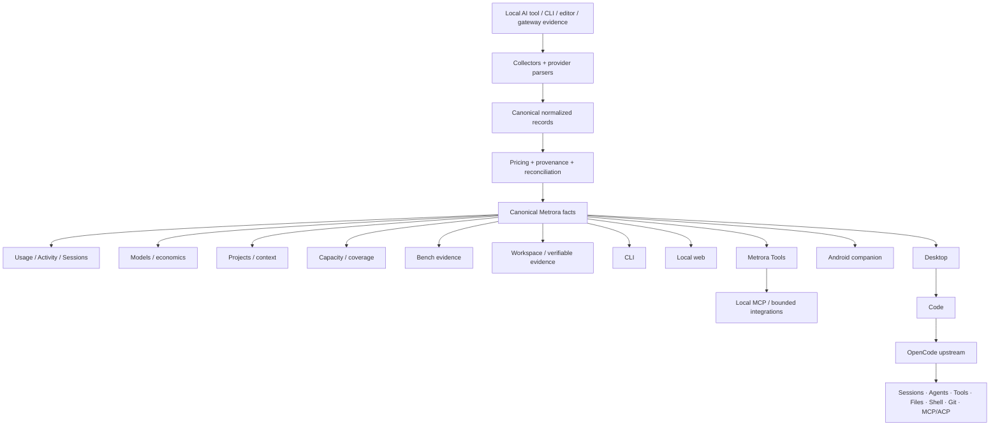

# Metrora architecture

This document explains the responsibility map of the public Metrora codebase: where facts come from, which surface owns which behavior, and why the Code integration deliberately relies on upstream OpenCode instead of growing a second generic coding-agent engine.

## Architectural thesis

Metrora is a **local-first control center for AI-assisted development**.

Its public architecture follows two rules:

> **Facts have one canonical authority.**
>
> **Metrora adds. OpenCode executes.**

The first rule prevents Desktop, CLI, Android, MCP and Code integrations from inventing independent versions of usage, pricing or evidence.

The second rule keeps Metrora focused on differentiated product value — measurement, evidence, Projects, Capacity, Bench, context and control — while upstream OpenCode owns commodity coding-agent mechanics inside Code.

## System map



The diagram is intentionally asymmetric: Code is not another Metrora factual engine, and Android is not another collector. Both consume or complement the canonical Metrora layer according to their responsibility.

## Product authority

The public repository is authoritative for the local Metrora factual/product layer, including:

- collection and provider parsing;
- normalization, deduplication and reconciliation;
- historical pricing and cost assignment;
- Usage, Activity, Sessions, Models and Project analytics where implemented;
- provider-reported Capacity semantics;
- Bench evidence and methodology boundaries;
- canonical Metrora Tool contracts;
- local Workspace/evidence contracts;
- user-owned export and public interoperability boundaries.

Metrora is local-first:

- ordinary local use requires no Metrora account or hosted service;
- supported AI traffic does not need to pass through a Metrora proxy;
- prompts, responses, source code, patches, secrets and unrestricted local paths are outside the ordinary sharing boundary;
- settled historical cost assignments remain stable;
- missing, stale, partial or unavailable evidence remains explicit rather than becoming a false zero.

## Canonical factual path

```text
source evidence
    ↓
provider-specific collector/parser
    ↓
normalized call / canonical identity
    ↓
pricing + provenance + reconciliation
    ↓
shared factual projections
    ↓
Desktop · CLI · local web · Android · Tools · exports
```

A presentation surface may summarize or visualize canonical facts. It must not silently reinterpret stronger evidence or create a second pricing/accounting authority.

### Collection and parsing

Provider adapters discover source records and emit normalized calls through shared parser contracts.

Key rules:

- source-present provider/model metadata is preferred over inference;
- deduplication uses canonical identities shared across providers;
- parser caches accelerate reads but do not become independent truth;
- reconciliation preserves provenance and fails closed on contradictions;
- provider-specific parsing stays isolated from product presentation.

New or changed collectors require fixtures, focused tests, provenance review and representative-record validation where possible.

### Pricing and accounting

Historical API-equivalent pricing is date-effective and evidence-aware.

- provider/client metered values remain authoritative when available;
- explicit zero is different from unavailable pricing;
- subscription or proxy coverage is an overlay rather than a rewrite of historical API-equivalent value;
- later pricing catalog updates cannot silently rewrite settled calls;
- fallback behavior stays explicit and conservative.

Pricing logic belongs in shared domain modules rather than Desktop components, Code adapters or packaging scripts.

## Surfaces and ownership

### Electron Desktop — `app/`

Desktop is the primary graphical control center.

The Electron main process owns privileged host work such as:

- execution/resolution of the bundled Metrora runtime;
- local filesystem and OS-vault boundaries;
- endpoint/Workspace authority where applicable;
- bounded recovery, export and privileged actions;
- external URL/export-destination validation;
- OpenCode sidecar lifecycle, authentication, origin and view hosting.

The renderer consumes typed public DTOs through a narrow preload bridge. It must not become a second provider parser, pricing engine or factual authority.

### Code — upstream OpenCode hosted by Metrora

The Desktop **Code** destination embeds the official upstream [OpenCode](https://github.com/anomalyco/opencode) runtime and Web UI.

OpenCode owns:

```text
coding Sessions
Agents / Subagents
provider + model interaction inside Code
standard Tools
files / shell / Git
ordinary permissions / questions
MCP / ACP mechanics supplied by OpenCode
```

Metrora owns the surrounding integration boundary:

```text
pinned runtime provenance
loopback-only server lifecycle
per-launch host authentication
persistent browser/project state
navigation + popup restrictions
prewarmed host experience
clean shutdown
Windows packaging
Metrora accounting observation
bounded Metrora-specific factual context
```

This split avoids a second conversation/session universe for the same coding work.

Metrora accounting identifies activity from this source as **OpenCode**. Launching OpenCode inside Metrora does not invent a fake provider identity.

OpenCode is third-party upstream software and remains independently maintained. The integration does not imply project affiliation or endorsement.

See [`OPENCODE_UPSTREAM_SURFACE_001.md`](OPENCODE_UPSTREAM_SURFACE_001.md).

### CLI — `src/`

The canonical command is `metrora`.

The CLI routes into shared domain modules for:

- discovery/parsing;
- canonical aggregation and date filtering;
- pricing/evidence classification;
- reports, exports and diagnostics;
- Bench workflows;
- local read-only MCP;
- Workspace/evidence operations where documented.

The CLI is a transport/product surface over shared Metrora authority, not a separate factual engine.

### Local web — `dash/`

The local browser dashboard renders canonical Metrora payloads served from the user's machine. It does not own a second data model or hosted account authority.

### Android — `android/`

The Android companion is publicly distributed through Google Play and can also have a separately documented direct APK channel.

Android consumes bounded data from an explicitly paired Desktop. It does not independently collect AI-provider evidence, recalculate pricing or become canonical history authority.

### macOS / GNOME — `mac/`, `gnome/`

These source surfaces remain lightweight companion work over Metrora's canonical runtime. Source availability is not the same as an accepted public distribution channel.

## Metrora Tools

Metrora Tools expose bounded factual capabilities from the shared registry/contract layer.

The architectural goal is reuse:

```text
canonical Metrora facts
        ↓
canonical Tool registry
   ┌────┼──────────┐
   ↓    ↓          ↓
  MCP  Code   other bounded integrations
```

A new consumer should adapt to this registry rather than copy accounting/evidence logic into its own transport.

Tool results preserve unavailable/stale/partial semantics. A calling model may explain evidence but cannot silently replace the underlying Metrora measurement or scope.

## MCP and external interoperability

The current public Metrora MCP Server V1 is **local and read-only**. It exposes bounded factual Metrora capabilities without turning Metrora into a mandatory AI-request proxy.

Future state-changing/external control is a separate architecture problem. Public direction may include bounded external control and remote/background supervision, but those capabilities require explicit trust/control objects rather than granting generic execution authority because MCP exists.

## Bench

Bench is an evidence system with explicit methodologies, not a universal AI score.

Current public families include Performance and Compatibility/Runtime Health foundations. Coding Evaluation and Agent Evaluation remain separately gated future methodologies.

Real Agent/Subagent execution already exists through OpenCode; reproducible Agent Evaluation still requires its own dataset, methodology, isolation and comparison contract.

## Local Workspace and verifiable evidence

Workspace v1 is endpoint-owned and can work without a remote service.

The public local foundation includes:

- protected endpoint identity and OS-vault material;
- local Workspace state/membership;
- reviewed measurement production;
- append-only/outbox evidence where applicable;
- truthful inspection and non-destructive recovery;
- Workspace-authorized signed batches;
- independently verifiable user-owned exports.

Opening the application may inspect evidence automatically, but recovery remains explicit when mutation is required.

## Public contracts

Versioned contracts under `src/contracts/` define stable boundaries for endpoints, Workspaces, repositories, sharing, measurements and evidence.

Contract evolution requires:

- explicit versioning or compatible extension;
- validation at trust boundaries;
- migration/rollback analysis;
- privacy review;
- fixtures/conformance tests;
- no silent reinterpretation by another surface.

## Distribution integrity

Official Windows distribution is live through Microsoft Store under publisher Vensent. The current public Store line is RC11.

Android is live on Google Play under package identity `eu.metrora.app`; the direct APK channel remains separately documented.

Distribution work preserves these boundaries:

- artifacts trace to reviewed public source;
- package/channel identity is exact rather than guessed;
- checksums/manifests/provenance are independently verifiable where documented;
- installation/update/rollback preserve user-owned state;
- technical validation artifacts stay visibly separate from official Store releases;
- build, verification, publication and rollback remain separate responsibilities.

See [`WINDOWS_DISTRIBUTION.md`](WINDOWS_DISTRIBUTION.md), [`ANDROID_PUBLIC_DISTRIBUTION_V1.md`](ANDROID_PUBLIC_DISTRIBUTION_V1.md) and [`VERSIONING.md`](VERSIONING.md).

## Security boundaries

- no shell interpolation for untrusted command arguments;
- no Node integration in ordinary renderer code;
- no protected distribution credentials in untrusted pull requests;
- no raw prompt/source/secret material in factual reports or logs;
- no destructive reset disguised as recovery;
- no weakening of the upstream Code host boundary merely for convenience;
- no deployment-time patching of product semantics or visual identity.

## Public direction without private sequencing

The public architecture is designed to support stronger capabilities over time without advertising private implementation sequencing.

Directionally:

```text
better factual Sessions / Models / Activity
                ↓
richer Projects / Capacity / Bench context
                ↓
more reusable Tools across Code and integrations
                ↓
bounded external control / remote supervision
                ↓
evidence-aware assistance and automation
```

That direction does not require a private fork of OpenCode or a second generic agent/session engine.

## Repository map

```text
src/       collection, parsing, pricing, analytics, evidence, Tools and CLI
app/       Electron Desktop host and product UI, including Code host integration
dash/      local browser dashboard
android/   Google Play / direct-channel Android companion source
mac/       macOS companion source
gnome/     GNOME Shell companion source
tests/     core and integration tests
docs/      user guidance, architecture, contracts and release evidence
scripts/   bounded build, verification, migration and release utilities
```

Compatibility identifiers retained for installed-state safety are governed by [`TECHNICAL_IDENTITY_COMPATIBILITY.md`](TECHNICAL_IDENTITY_COMPATIBILITY.md), not treated as current product branding.

## Change discipline

Every substantial change should identify:

- which authority it modifies;
- which public contract/compatibility boundary is involved;
- focused and full validation required;
- migration/rollback behavior;
- privacy/provenance impact;
- documentation that must remain accurate.

Prefer bounded, independently revertible changes. Do not solve architectural growth by duplicating an existing authority or by raising safety limits instead of fixing responsibility boundaries.
